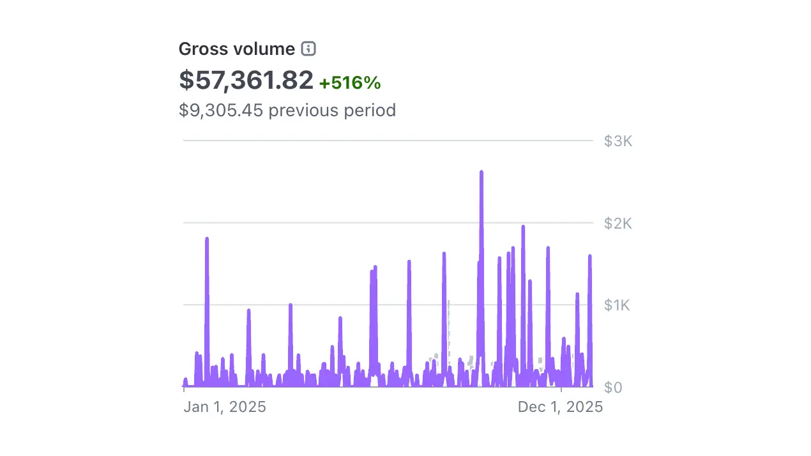
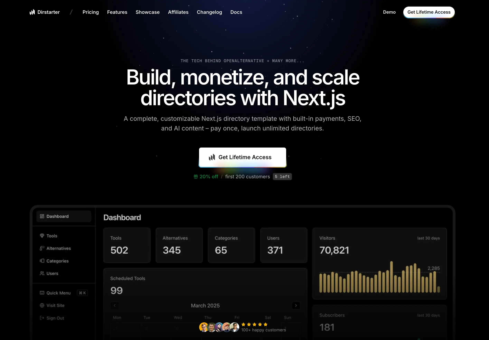

As 2025 comes to a close, I'm reflecting on an incredible year. It's been defined by hitting milestones I never thought possible, growing projects I care about, and fundamentally changing how I write code. It's also been my highest revenue year since I started working (almost 20 years ago).

Here's a look at everything that happened.

## OpenAlternative: From Side Project to 1M Visitors and $57,361 in Revenue

The biggest win of 2025 was [OpenAlternative](https://openalternative.co) crossing **1 million unique visitors**. When I launched in early 2024 and [hit 100k visitors in the first week](/posts/openalternative-launch), I thought I'd reached the peak. I was wrong.

Throughout 2025, the site grew organically. The SEO strategy I implemented early on kept paying dividends. Pages I created for programmatic SEO started ranking for competitive keywords, driving steady traffic month after month.

What made this growth special wasn't just the numbers—it was the community forming around it. People started submitting their own open source alternatives, sharing the site in developer communities, and using it as a reference for software decisions.

Looking back, a few key factors contributed to this milestone:

- **Consistent content updates** – regularly adding new tools kept the site fresh
- **Community submissions** – letting users contribute made it a collaborative project
- **Patience with SEO** – the long-term strategy paid off more than any quick wins

Reaching 1 million visitors with a project I built in 48 hours feels surreal. It's proof that starting simple and iterating works.

### Turning Traffic into Revenue

But traffic alone doesn't pay the bills. This year, I focused on monetization, and it paid off. OpenAlternative generated **$57,361 in gross revenue**, a **516% increase** from the previous year. By December, the project crossed **$6k MRR** – a milestone I never dreamed of when I started.

The revenue comes from a mix of featured listings, sponsorships, and advertising. What started as a free directory now has a sustainable business model that lets me keep investing in the project.

Seeing those numbers climb throughout the year was incredibly motivating. It validated that you can build something useful, keep it free for users, and still generate meaningful revenue.

## Dirstarter: $22k in Revenue

While OpenAlternative grew, I noticed a pattern across my other directory projects: I was rebuilding the same features over and over.

I decided to package everything I'd learned into [Dirstarter](https://dirstarter.com) – a Next.js boilerplate for building profitable directory websites.

The result? **$22,000 in total revenue** ([proof](https://trustmrr.com/startup/dirstarter)).

What worked:

- **Building in public** – sharing the journey on Twitter attracted early customers
- **Solving my own problem** – the boilerplate came from real experience, not theory
- **Focusing on a niche** – directory websites are specific enough to attract serious buyers

The best part is hearing from customers who launched their own directories using Dirstarter. Some have already started generating revenue from their sites, which is incredibly rewarding.

## Expanding the Portfolio

Beyond these two flagships, I continued expanding my portfolio:

- [DevSuite](https://devsuite.co) – helping developers find the right tools for their projects
- [EuroAlternative](https://euroalternative.co) – discovering European alternatives to big tech
- [OpenAds](https://openads.co) – automating ad spot management for content creators

Each project taught me something new. DevSuite helped me understand the developer tools market. EuroAlternative proved there's demand for region-specific alternatives. OpenAds pushed me to build more complex SaaS features.

The directory website niche has been good to me. There's something satisfying about curating useful resources and watching people find value in them.

## Letting Go of Old Projects

Not everything in 2025 was about building new things. Sometimes growth means knowing when to let go.

This year, I made the decision to **shut down [Superstash](https://superstash.co)** – a no-code platform for creating directory websites that I'd been running for a while. Despite genuine effort, I wasn't able to find the momentum needed to grow it into a sustainable business. Rather than letting it limp along, I decided to sunset it gracefully. The lessons learned from Superstash directly shaped Dirstarter, so in a way, it lives on.

I also **open sourced [Chipmunk Theme](https://chipmunktheme.com)**, my premium WordPress theme. All the premium features are now available for free on [GitHub](https://github.com/chipmunktheme/chipmunk). It felt like the right move to give back to the community and let others enjoy something I'd built without any barriers.

Closing and releasing these projects was bittersweet, but it freed up mental space to focus on what's working. Sometimes the best thing you can do for a project is to let it go.

## How AI Changed My Workflow

I can't talk about 2025 without mentioning AI. This year, I fully embraced [Cursor](https://cursor.com) and [Claude Code](https://claude.ai) in my development workflow.

The shift is remarkable. Tasks that used to take hours now take minutes. Prototyping happens at a pace I couldn't have imagined a few years ago. When I have an idea, I can validate it quickly instead of spending days on boilerplate.

Some ways AI improved my workflow:

- **Faster prototyping** – going from idea to working code in a fraction of the time
- **Better code quality** – AI catches issues I might miss and suggests improvements
- **Learning accelerator** – exploring new libraries and frameworks with an AI pair programmer

The industry stats are staggering: 41% of all code written in 2025 was AI-generated. GitHub Copilot has over 15 million developers. We're living through a fundamental shift in how software gets built.

I'm optimistic about the future. AI isn't replacing developers; it's amplifying what we can do. The best code still comes from developers who understand the problem deeply and can guide the AI effectively.

## Content and Community

Beyond shipping products, I focused on sharing what I learned. Writing content, engaging on social media, and connecting with other indie hackers has been a highlight of the year.

The developer community continues to be incredibly supportive. Conversations on Twitter, feedback from readers, and collaborations with other builders have all contributed to the growth of my projects.

Building in public is powerful. When you share the journey—the wins and the process—people root for your success.

## Looking Forward to 2026

Looking ahead to 2026, I'm excited for what's next:

- Continuing to grow OpenAlternative and serve the open source community
- Expanding Dirstarter with new features based on customer feedback
- Exploring new project ideas brewing in the background
- Pushing the boundaries of AI-assisted development

2025 proved what's possible with focus, consistency, and a willingness to share the journey. I'm grateful for everyone who's been part of it—whether you visited OpenAlternative, bought Dirstarter, or just followed along on social media.

Here's to an even better 2026 🥂
